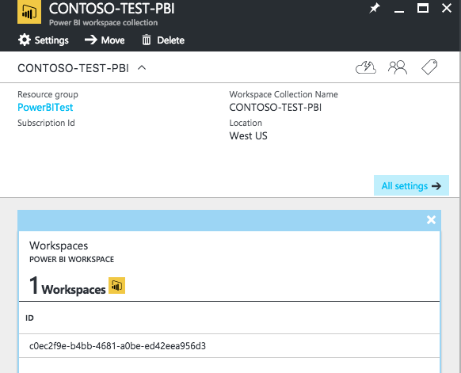
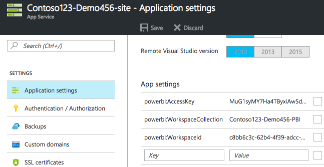

# PBIEmbDeploy

This Powershell script allow you to :
* Install the Azure CLI and PowerBI CLI on your machine
* Deploy a new Power BI Embedded resource on your Azure Subscription
* Create a Workspace in the PBI Collection
* Import a PBIX file (Only One for now)
* Deploy a Hosting Plan and a WebApp on Azure
* Deploy a custom code from github on the WebApp ([Sample per default](https://github.com/Azure-Samples/power-bi-embedded-integrate-report-into-web-app))
* Apply the parameters and connection string to print your .pbix inside this WebApp

All in one command, the deploy.ps1 file.

[PowerShell](https://github.com/PowerShell/PowerShell) is Xplat, so you can run this script from a Unix or Windows Environnement, tested on a Mac and Windows.

## Usage

1. Clone the repo : `git clone https://github.com/julienstroheker/PBIEmbDeploy`
2. Copy your .PBIX file in the myReport folder
3. Run the ./deploy.ps1 file : `powershell ./deploy.ps1 -ResourceGroupName <MyResourceGroup> -Location <Location> -PrefixName <CONTOSO> -PrefixNameEnv <DEV>`

> Note : The *PrefixName* and *PrefixNameEnv* will add a prefix at the PowerBI resource created on Azure. Ex : CONTOSO-TEST-PBI

Example :

`./deploy.ps1 -ResourceGroupName "DemoGithub" -Location "West US" -PrefixName "Contoso123" -PrefixNameEnv "Demo456"`

> Note : you can use two optional parameters (boolean) when you call the script : Prerequisites and Authentication

> Note : You have to be authenticated on Azure from you machine by using the command : `azure login` or you can run the command with the parameter 'Authentication' at 1 like `./deploy.ps1 -Authentication 1 -ResourceGroupName <MyResourceGroup> -Location <Location> -PrefixName <CONTOSO> -PrefixNameEnv <DEV>`

## Prerequisites

You need to have installed on your machine :
* [PowerShell](https://github.com/PowerShell/PowerShell) 
* [NPM (NodeJS)](https://nodejs.org/en/download/)
* [Azure-CLI](https://github.com/Azure/azure-xplat-cli)
* [PowerBI-CLI](https://github.com/Microsoft/PowerBI-Cli)
* [Retail Analysis Sample PBIX Sample - Optional](http://go.microsoft.com/fwlink/?LinkID=780547)

> Note : You can just install manually node and then run `./deploy.ps1 -Prerequisites 1 -ResourceGroupName <MyResourceGroup> -Location <Location> -PrefixName <CONTOSO> -PrefixNameEnv <DEV>` to install the Azure-CLI and PowerBI-CLI packages on your machine.

## Deploy your own Website code 

If you want to don't use the [Microsoft sample](https://github.com/Azure-Samples/power-bi-embedded-integrate-report-into-web-app) you can fork this repository and modify the deployWebApp.json from the template folder.

Do a search for the variable name : repoURL and paste the URL of your own Github repo.

## More infos 

* [PowerBi Embedded Get Started Sample Documentation](https://docs.microsoft.com/en-us/azure/power-bi-embedded/power-bi-embedded-get-started-sample)
* [PowerBi Embedded Get Started Sample Github Repository](https://github.com/Azure-Samples/power-bi-embedded-integrate-report-into-web-app)

## Reach me at [@ju_stroh](https://twitter.com/Ju_Stroh)

